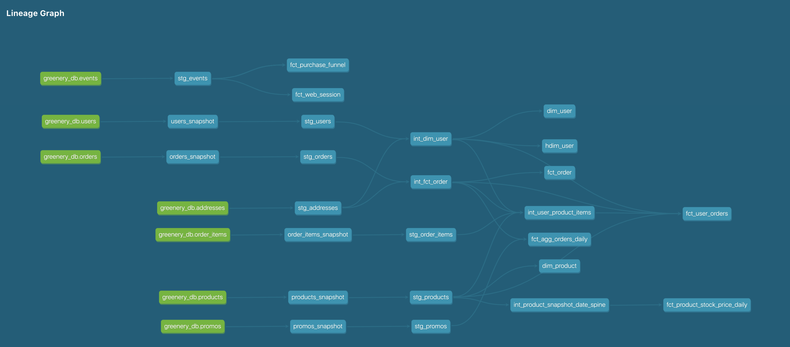

# Week 1 Project Instructions
- Please, go to `dbt-greenery/models/staging` - this folder will contain all staging models
- To check snapshots configurations, go to `dbt-greenery/snaphots`. 
- The answers to projects questions are in `dbt-greenery/models/staging/readme_first_project.md`

# Week 2 Project Instructions
- Please, go to `dbt-greenery/models/marts` - this folder contains all created marts
- The answers to project questions are in `dbt-greenery/models/README_W2.md`

## DAG: 

